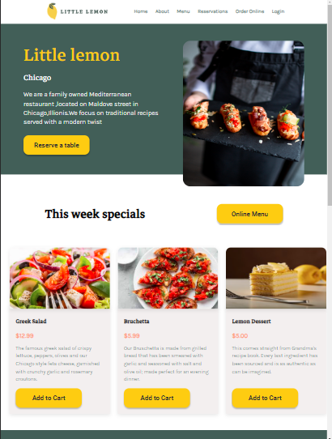
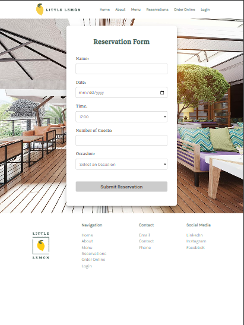

# Little Lemon Web App

The "Little Lemon" web app is the capstone project of the Meta Front Developer Professional Certificate course. It serves as a landing page for a lemon-lemon restaurant and provides users with a booking form to make reservations.

## Project Overview

The goal of the "Little Lemon" web app is to create a booking form to facilitate reservations, providing a seamless experience for users.




## Features

- **Landing Page:** A visually appealing landing page that introduces users to the "Little Lemon restaurant"

- **Booking Form:** A user-friendly booking form that allows users to make reservations easily. The form captures necessary details such as name, date, time, and any specific preferences.

## Technologies Used

- HTML
- CSS
- JavaScript
- React 

## Installation

Follow these steps to set up and run the "Little Lemon" web app project locally:

1. **Clone the repository:**
   ```bash
   git clone https://github.com/Kainat18/little-lemon-website.git

# Getting Started with Create React App

This project was bootstrapped with [Create React App](https://github.com/facebook/create-react-app).

## Available Scripts

In the project directory, you can run:

### `npm start`

Runs the app in the development mode.\
Open [http://localhost:3000](http://localhost:3000) to view it in your browser.

The page will reload when you make changes.\
You may also see any lint errors in the console.

### `npm test`

Launches the test runner in the interactive watch mode.\
See the section about [running tests](https://facebook.github.io/create-react-app/docs/running-tests) for more information.

### `npm run build`

Builds the app for production to the `build` folder.\
It correctly bundles React in production mode and optimizes the build for the best performance.

The build is minified and the filenames include the hashes.\
Your app is ready to be deployed!

